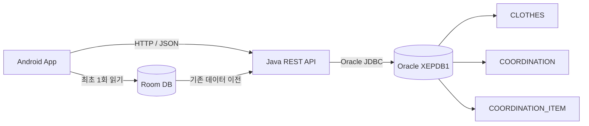
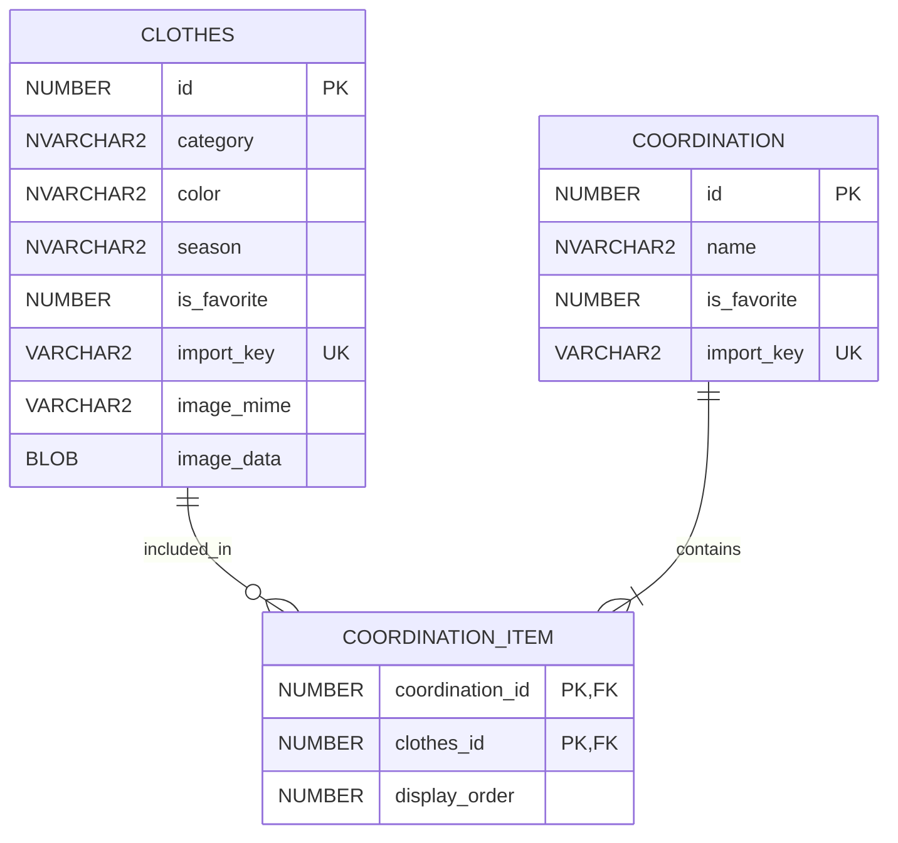

# Smart Closet with Oracle XE

Android에 등록한 의류와 코디를 Java REST API를 통해 Oracle Database에 저장하는 스마트 클로젯 프로젝트입니다.

## 핵심 기능

- 갤러리와 카메라를 이용한 의류 사진 등록
- 옷 종류, 색상, 계절 기준 분류 및 필터링
- 단품 의류와 코디 즐겨찾기
- 개수 제한 없는 코디 구성 및 한글 코디 이름 저장
- 의류 삭제와 코디 상세 조회
- 기존 Room 데이터의 Oracle 이전
- Oracle BLOB 기반 이미지 저장

## 기술 스택

| 영역 | 기술 |
| --- | --- |
| Android | Java, XML, AndroidX, RecyclerView |
| 이미지 | Glide, Internal Storage |
| 로컬 이전 | Room Database |
| API 서버 | Java 17, HttpServer, Gson |
| 데이터베이스 | Oracle Database XE 21c, JDBC |
| 개발 환경 | Android Studio, Gradle, PowerShell |

## 시스템 구조



Android 에뮬레이터는 `http://10.0.2.2:8080`으로 PC의 API 서버에 접근합니다. API 서버는 `127.0.0.1`에 바인딩되고 JDBC로 Oracle `XEPDB1`에 접속합니다. DB 비밀번호는 앱과 저장소에 포함하지 않고 서버 실행 시에만 입력합니다.

## 데이터베이스 설계



`COORDINATION_ITEM`을 연결 테이블로 사용해 하나의 코디에 여러 의류를 순서대로 저장합니다. 의류가 삭제되면 외래키의 `ON DELETE CASCADE`로 연결 정보도 정리됩니다.

## API 기능

| Method | Endpoint | 기능 |
| --- | --- | --- |
| `GET` | `/health` | Oracle 연결 상태 확인 |
| `GET` | `/clothes` | 의류 목록 조회 |
| `POST` | `/clothes` | 메타데이터와 이미지 등록 |
| `GET` | `/clothes/{id}/image` | Oracle BLOB 이미지 조회 |
| `PUT` | `/clothes/{id}/favorite` | 의류 즐겨찾기 변경 |
| `DELETE` | `/clothes/{id}` | 의류 삭제 |
| `GET` | `/outfits` | 코디 목록과 구성 의류 조회 |
| `POST` | `/outfits` | 코디 이름과 의류 관계 저장 |
| `PUT` | `/outfits/{id}/favorite` | 코디 즐겨찾기 변경 |

서버의 SQL은 `PreparedStatement`를 사용합니다. 코디와 연결 의류 저장, 의류 삭제 후 빈 코디 정리는 트랜잭션으로 처리합니다.

## 프로젝트 구조

```text
app/       Android 앱, 화면, RecyclerView, Oracle API 클라이언트
server/    Java REST API와 Oracle JDBC 처리
db/        사용자/테이블 생성 및 발표용 SQL 스크립트
gradle/    Gradle Wrapper
```

주요 구현 파일:

- `app/src/main/java/com/example/smartcloset/data/OracleApi.java`: Android HTTP 클라이언트
- `app/src/main/java/com/example/smartcloset/ui/MainActivity.java`: 기존 Room 데이터 이전
- `server/src/main/java/com/example/smartcloset/server/ServerMain.java`: REST API와 Oracle SQL
- `db/create_user.sql`, `db/schema.sql`: DB 사용자와 테이블 생성
- `db/demo_queries.sql`: 발표용 데이터 조회
- `db/admin_checks.sql`: PDB와 DB 세션 상태 조회

## 실행 방법

### 1. Oracle 준비

Oracle XE 21c의 `OracleServiceXE`, `OracleOraDB21Home1TNSListener` 서비스가 실행 중이어야 합니다. 프로젝트 폴더에서 다음 명령을 실행합니다.

```powershell
sqlplus -L system@localhost:1521/XEPDB1 @db/create_user.sql
sqlplus -L smart_closet@localhost:1521/XEPDB1 @db/schema.sql
```

두 명령 모두 비밀번호를 대화형으로 입력받습니다. `create_user.sql`은 `SMART_CLOSET` 전용 계정에 필요한 권한과 USERS 테이블스페이스 200MB를 할당하고, `schema.sql`은 테이블 3개와 제약조건을 생성합니다.

이미 계정과 테이블을 만든 환경에서는 생성 스크립트를 다시 실행하지 않습니다.

### 2. DB 운영 상태 확인

```powershell
Get-Service OracleServiceXE, OracleOraDB21Home1TNSListener
lsnrctl status
sqlplus -L system@localhost:1521/XE @db/admin_checks.sql
```

`admin_checks.sql`은 PDB 열림 상태와 `SMART_CLOSET` 세션 수를 조회합니다.

### 3. API 서버 실행

Android 앱보다 먼저 별도 PowerShell 창에서 실행하고 창을 유지합니다.

```powershell
powershell -ExecutionPolicy Bypass -File .\server\run.ps1
```

비밀번호 입력 후 `Smart Closet Oracle API ready...`가 표시되면 상태 API를 확인합니다.

```powershell
Invoke-RestMethod http://127.0.0.1:8080/health
```

정상 응답:

```json
{
  "database": "oracle",
  "connected": true
}
```

### 4. Android 앱 실행

1. Android Studio에서 프로젝트를 엽니다.
2. Gradle Sync를 실행합니다.
3. AVD를 선택하고 앱을 실행합니다.
4. 의류를 등록한 뒤 내 옷장과 코디북에서 결과를 확인합니다.

실물 Android 기기는 PC 주소가 `10.0.2.2`가 아니므로 현재 설정으로 연결되지 않습니다. 이 프로젝트의 Oracle 연동 시연은 AVD 기준입니다.

## 기존 Room 데이터 이전

앱은 최초 실행 시 기존 Room 의류와 코디를 Oracle로 이전합니다.

- 원본 Room DB는 삭제하지 않습니다.
- `import_key`를 사용해 재시도 시 중복 저장을 방지합니다.
- 사진 파일이 없거나 이미지가 6MB를 초과하면 이전을 완료 처리하지 않습니다.
- 이전 실패 시 사용자에게 오류를 표시하고 다음 실행에서 다시 시도합니다.

## 발표 시연 순서

1. `/health` 응답으로 Java 서버와 Oracle 연결 확인
2. 앱에서 의류 사진과 메타데이터 등록
3. 내 옷장에서 등록 결과와 필터링 확인
4. 여러 의류를 선택해 한글 이름의 코디 저장
5. 즐겨찾기 변경과 의류 삭제 시연
6. SQL*Plus에서 실제 Oracle 데이터를 조회

```powershell
sqlplus -L smart_closet@localhost:1521/XEPDB1 @db/demo_queries.sql
```

`demo_queries.sql`은 의류 속성과 이미지 크기, 코디별 의류 수, 코디-의류 조인 결과, 즐겨찾기 데이터를 출력합니다. 앱 조작 직후 SQL 결과가 바뀌는 것으로 실제 Oracle 연동을 보여줄 수 있습니다.

## 구현 중 해결한 문제

- Android에서 Oracle에 직접 접속하지 않고 Java API 계층을 두어 DB 인증정보를 분리했습니다.
- 2개 의류로 제한되던 코디 구조를 연결 테이블 기반의 다대다 구조로 변경했습니다.
- 기존 Room ID와 Oracle ID 차이를 매핑하고 `import_key`로 이전 작업을 멱등하게 만들었습니다.
- 이미지 파일을 Base64로 전송하고 Oracle BLOB으로 저장한 뒤 Glide가 API URL에서 불러오도록 구성했습니다.
- DB 변경 작업에 PreparedStatement와 트랜잭션을 사용해 SQL 처리 안정성을 높였습니다.

## 제한 사항

- 현재 서버는 로컬 발표 시연용이며 사용자 인증과 TLS가 없습니다.
- 서버는 루프백 주소에만 바인딩되므로 외부 네트워크에 공개되지 않습니다.
- 이미지 한 개의 최대 크기는 6MB입니다.
- 날씨 기반 추천 API는 향후 구현 항목입니다.
